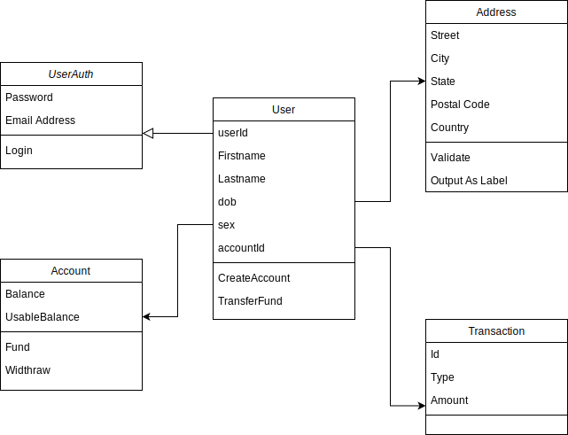

# lendsqr

# Models in the Service
The different models that make up the system includes. 
* User Auth. 
* User
* Account
* Transaction

## Creating a Customer
When a request is made to create a customer, a user auth is created using the supplied email and password.
This is necessary in order to prevent pulling all user information from the database just for authentication.
